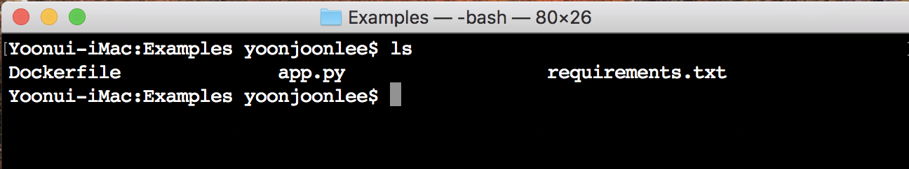
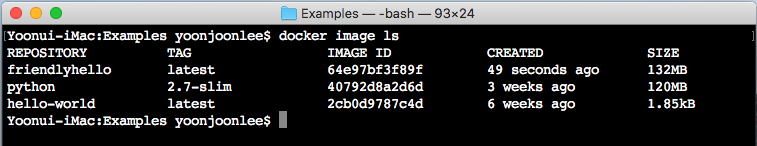
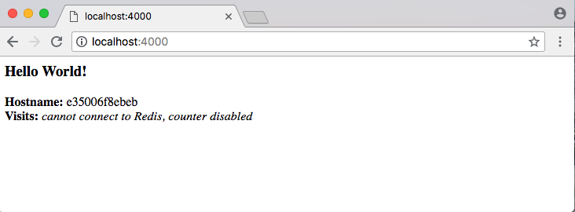
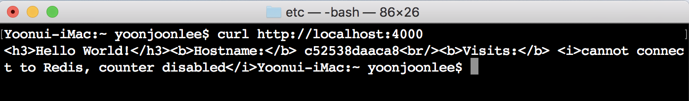
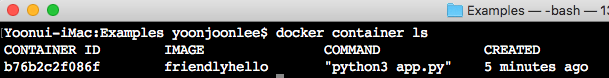
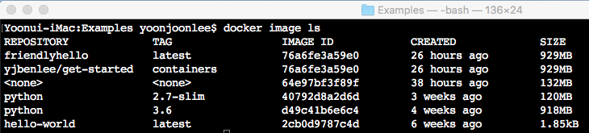
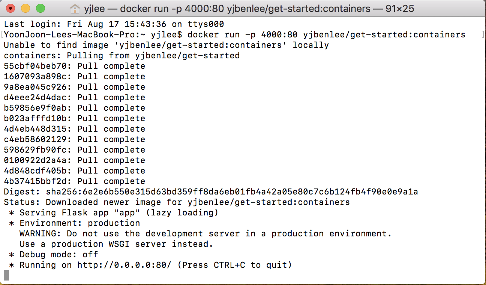

### 컨테이너

#### 준비 사항

-	[Docker 버전 1.13 또는 그 이후 버전을 설치하십시오](https://docs.docker.com/engine/installation/).
-	[Orientation](getstarted.md)을 공부 하십시오.
-	환경을 신속하게 테스트하여 모든 설정이 완료되었는지 확인하십시오.

	```
	docker run hello-world
	```

#### 개요

Docker 방식으로 앱을 제작하는 방법에 대하여 알아봅니다. 앱을 구성하는 계층 구조의 맨 아래 계층에서부터 시작합니다. 앱은 컨테이너이며, 여기에서 설명하고자 합니다. 바로 윗 계층은 컨테이너가 운영 환경에서 작동하는 방식을 정의하는 서비스로 [서비스](services.md)에서 설명합니다. 마지막으로 최상위 레벨인 [스택](stacks.md)은 서비스들간의 상호작용을 정의합니다.

-	스택
-	서비스
-	**컨테이너** (여기서 설명하는 부분입니다)

#### 새로운 개발 환경

과거에 Python 앱을 작성하려면 최우선으로 Python 런타임을 시스템에 설치하는 것이 었습니다. 하지만, 이때 개발 환경과 운영 환경이 일치되도록 환경을 구축하여야 했습니다.

Docker를 사용하면 별도의 설치 없이 포터블(portable)한 Python 런타임을 이미지로 가져올 수 있습니다. 그리고 앱, 종속성을 갖는 라이브러리, 런타임 등이 모두 함께 할 수 있도록 개발하는 앱 코드와 이들을 함께 Python 이미지에 포함하여 빌드합니다.

<code>Dockerfile</code>을 사용하여 포터블 이미지를 정의합니다.

#### <code>Dockerfile</code>로 컨테이너 만들기

<code>Dockerfile</code>은 컨테이너 내부 환경을 설정합니다. 네트워킹 인터페이스 및 디스크 드라이브와 같은 리소스에 대한 액세스를 가상화하여 시스템에서 격리시킵니다. 그리하여 외부와 통신에 필요한 포트를 정의하고 그 환경으로 "복사"할 파일을 지정하여야 합니다. <code>Dockerfile</code>에 정의한 대로 빌드된 앱은 어느 플랫폼에서나 똑같이 작동할 것이라고 기대할 수 있습니다.

##### <code>Dockerfile</code>

먼저, 새로운 디렉토리를 만듭니다. <code>cd</code>명령을 사용하여 현재 디렉토리를 새 디렉토리로 변경하고 <code>Dockerfile</code>이라는 파일에 다음 내용을 복사하여 저장하십시오. 아래에서 새로운 <code>Dockerfile</code>의 주석을 설명합니다.

```
# Use an official Python runtime as a parent image
FROM python:3.6

# Set the working directory to /app
WORKDIR /app

# Copy the current directory contents into the container at /app
ADD . /app

# Install any needed packages specified in requirements.txt
RUN pip install --trusted-host pypi.python.org -r requirements.txt

# Make port 80 available to the world outside this container
EXPOSE 80

# Define environment variable
ENV NAME World

# Run app.py when the container launches
CMD ["python3", "app.py"]
```

이 <code>Dockerfile</code>에 없는 파일, 즉 <code>app.py</code>와 <code>requirements.txt</code>를 참조합니다. 다음 단계에서 바로 만들어 보겠습니다.

#### 앱

<code>Dockerfile</code>과 같은 폴더에 <code>requirements.txt</code>와 <code>app.py</code> 파일을 만듭니다. 아래에서 볼 수 있듯이 아주 간단한 앱을 만들었습니다. <code>Dockerfile</code>으로 이미지를 구성하면 <code>Dockerfile</code>의 <code>ADD</code>로 인해 <code>app.py</code> 및 <code>requirements.txt</code>를 찾을 수 있고 <code>EXPOSE</code>로 <code>app.py</code>의 출력을 HTTP를 통해 볼 수 있습니다.

##### <code>requirements.txt</code>

```
Flask
Redis
```

##### <code>app.py</code>

```python
from flask import Flask
from redis import Redis, RedisError
import os
import socket

# Connect to Redis
redis = Redis(host="redis", db=0, socket_connect_timeout=2, socket_timeout=2)

app = Flask(__name__)

@app.route("/")
def hello():
    try:
        visits = redis.incr("counter")
    except RedisError:
        visits = "<i>cannot connect to Redis, counter disabled</i>"

    html = "<h3>Hello {name}!</h3>" \
           "<b>Hostname:</b> {hostname}<br/>" \
           "<b>Visits:</b> {visits}"
    return html.format(name=os.getenv("NAME", "world"), hostname=socket.gethostname(), visits=visits)

if __name__ == "__main__":
    app.run(host='0.0.0.0', port=80)
```

이제 <code>pip install -r requirements.txt</code>가 Python용 Flask 및 Redis 라이브러리를 설치하고 앱이 <code>socket.gethostname()</code>에 대한 호출 결과와 함께 환경 변수 <code>NAME</code>을 인쇄하는 것을 볼 수 있습니다. 마지막으로, Redis가 실행되지 않으면 (Redis 자체가 아닌 Python 라이브러리만을 설치 했으므로) 여기에서 사용하려는 시도는 실패하고 오류 메시지가 나타납니다.

> Note : Linux에서 실행중 실행 파일을 프로세스 ID로 찾아 볼 수 있듯이 호스트 이름으로부터 컨테이너 ID로 호스트에서 실행 중인 컨테이너를 찾을 수 있습니다.

이상입니다. 생성된 앱 수행을 위하여 <code>requirements.txt</code> 또는 Python은 더이상 필요하지 않으며 이미지를 빌드하거나 실행해도 시스템에 설치되지 않습니다. Python과 Flask로 환경을 설정한 것처럼 보이지도 않습니다. 그러나 앱에는 포함되어 있습니다.

#### 앱 빌드

이제 앱을 만들 준비가 되었습니다. 새 디렉토리의 최상위 레벨에 있는지 확인하십시오. 여기에 어떤 파일이 있나 확인하여 봅니다:



빌드 명령을 실행하면 Docker 이미지가 만들어지며, 이 이미지는 태그 -t를 사용하여 이름를 지정할 수 있습니다.

```
$ docker build -t friendlyhello
```

빌드된 이미지는 컴퓨터의 로컬 Docker 이미지 레지스트리에 있습니다.



> <u>[Linux 사용자를 위한 문제 해결](https://docs.docker.com/get-started/part2/#build-the-app)</u>
>
> 이 부분은 번역에서 생략하였습니다. 필요하면 제목에 link된 문서를 참조하십시요.

#### 앱 실행

응용 프로그램을 실행하여 <code>-p</code>를 사용하여 컴퓨터의 포트 4000을 컨테이너의 게시된 포트 80으로 매핑하여 응용 프로그램을 실행합니다.

```
docker run -p 4000:80 friendlyhello
```

Python이 <code>http://.0.0.0.0:80</code>에서 앱을 서비스한다는 메시지를 출력합니다. 메시지는 컨테이너 내부로부터 나오지만, URL <code>http://localhost:4000</code>이 컨테이너의 포트 80을 4000으로 매핑한 정보는 보여주지 않습니다.

웹 브라우저에 해당 URL을 입력하여 웹 페이지에 출력된 내용을 볼 수 있습니다.



shell에서 <code>curl</code> 명령을 사용하여 동일한 내용을 볼 수 있습니다.



<code>Dockerfile</code>의 <code>EXPOSE</code>에서 설정한 포트와 <code>docker run -p</code>를 실행할 때 지정된 포트가 다른 것은 포트 매핑에서 기인한 것임을 알 수 있습니다. 이후 호스트의 포트 4000을 컨테이너의 포트 80으로 매핑하고 <code>http://localhost</code>를 사용합니다.

<code>CTRL+C</code>를 눌러 컨테이너 <code>friendlyhello</code> 수행을 종료합니다.

> <u>Windows에서는 명시적으로 컨테이너를 중지하여야 합니다.</u>
>
> Windows 시스템에서 <code>CTRL+C</code>로는 컨테이너가 중지하지 않습니다. 따라서 컨테이너 수행을 종료시키 위하여 <code>CTRL+C</code>를 먼저 입력하여 shell 프롬프트를 다시 얻거나 다른 <code>Command Prompt</code> 윈도우를 연 다음 실행중인 컨테이너를 보여 주는 <code>docker container ls</code> 명령을 입력하고, 컨테이너를 중지하는 <code>docker container stop <Container NAME or ID></code> 를 실행합니다. 그렇지 않으면, 다음 단계에서 컨테이너를 다시 실행하려고 할 때 데몬는 오류 메시지를 출력합니다.

이제 백그라운드 모드로 앱을 실행하여 봅니다.

```
$ docker run -d -p 4000:80 friendlyhello
```

컨테이너가 백그라운드에서 실행 중입니다. 위 명령의 결과로 앱의 긴 컨테이너 ID를 터미널에 출력합니다. <code>docker container ls</code>으로 축약된 컨테이너 ID를 볼 수도 있습니다.



<code>CONTAINER ID</code>는 <code>http://localhost:4000</code>의 출력과 일치합니다.

<code>CONTAINER ID</code>를 사용하여 프로세스를 종료하려면 다음과 같이 <code>docker container stop</code>을 사용하십시오.

```
$ docker container stop b76b2c2f086f
```

#### 이미지 공유

방금 생성한 이미지의 이식성을 보이기 위하여 빌드된 이미지를 업로드하고 동일한 플랫폼의 다른 어느 컴퓨터에서 실행하여 봅시다. 결국 운영 환경에서 컨테이너를 전개하려면 레지스트리로 등록하는 방법을 알아야 합니다.

레지스트리는 리퍼지터리(repository)의 모음으로 리퍼지터리는 GitHub 리퍼지터리처럼 코드를 제외한 빌드된 이미지 모음입니다. 레지스트리의 계정은 많은 리포지토리를 생성할 수 있습니다. <code>docker</code> CLI는 기본적으로 Docker의 공용 레지스트리를 사용합니다.

> Note: Docker의 공용 레지스트리는 무료이며 미리 구성되어 있기 때문에 이 튜토리얼에서 사용합니다. 그러나 선택할 수있는 공용 레지스트리는 다수이며 <code>Docker Trusted Registry</code>를 사용하여 개인 레지스트리를 설정할 수도 있습니다.

##### Docker ID로 login

Docker 계정이 없다면 [hub.docker.com](https://hub.docker.com/)에 가입한 후, 사용자 이름을 기억하십시오.

로컬 시스템의 Docker 공용 레지스트리에 로그인하십시오.

```
$ docker login
```

### 이미지 태그

레지스트리의 리퍼지터리에 저장된 로컬 이미지를 <code>username/repository:tag</code> 형식으로 지칭합니다. 태그는 선택 사항이지만 Docker 이미지에 버전을 제공하는 데 사용하는 메커니즘이므로 권장합니다. 레퍼지터리를 지정하고 <code>get-started:containers</code>와 같이 의미있는 이름으로 태그하십시오. 그러면 이미지는 리퍼지터리에 저장되고 <code>containers</code>로 태그가 지정됩니다.

이제 이미지에 태깅을 합니다. 이미지를 원하는 컴퓨터에서 업로드할 수 있도록 username, repository와 tag를 지정하여 <code>docker tag image</code>를 다음과 같이 실행하십시오.

```
docker tag image username/repository:tag
```

예를 들면

```
docker tag friendlyhello /get-started:containers
```

<code>docker image ls</code> 명령을 실행하면 새로 태그가 추가된 것을 볼 수 있습니다.



##### 이미지 게시(Publish)

태그가 지정된 이미지를 리퍼지토리에 업로드합니다.

```
docker push username/repository:tag
```

완료되면 업로드 결과가 공개됩니다. [Docker Hub](https://hub.docker.com/)에 로그인하면 <code>pull</code> 명령으로 레퍼지토리에서 새 이미지를 볼 수 있습니다.

##### 원격 리퍼지토리로부터 이미지를 <code>pull</code>하여 실행하기

이제부터는 다음 명령으로 어떤 컴퓨터에서든 <code>docker run</code> 명령을 사용하여 앱을 실행할 수 있습니다.

```
docker run -p 4000:80 username/repository:tag
```

이미지가 로컬 컴퓨터에 없는 경우 Docker는 저장소에서 이미지를 가져옵니다.



<code>docker run</code>이 실행되는 위치에 관계없이 Python과 <code>requirements.txt</code>에서 지정한 실행에 필요한 모든 환경들과 함께 이미지를 가져 와서 코드를 실행합니다. 모두가 깔끔하고 작은 패키지로 함께 진행되므로 호스트 시스템에서 Docker가 앱을 실행하기 위해 호스트 시스템에 아무 것도 설치할 필요가 없습니다.

#### 마치며

다음 섹션에서는 서비스에서 여기서 배운 컨테이너를 실행하여 응용프로그램을 확장하는 방법을 살펴 봅니다.
