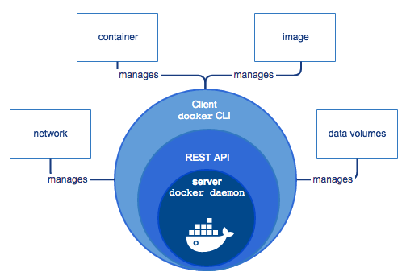

### Docker Overview

> [Docker overview](https://docs.docker.com/engine/docker-overview/)를 번역한 것입니다. 번역에 이상이 있거나 수정이 필요하다고 생각하시는 부분은 yoonjoon.lee@gmail.com으로 알려 주시기 바랍니다. 검토하여 적극 반영하겠습니다. 감사합니다.

Docker는 응용 프로그램을 개발, 적재(shipping) 및 실행하기 위한 개방형 플랫폼입니다. Docker를 사용하면 인프라에서 응용 프로그램을 분리하여 소프트웨어를 신속하게 제공할 수 있습니다. Docker를 사용하면 응용 프로그램을 관리하는 것과 동일한 방법으로 인프라를 관리할 수 있습니다. 코드를 신속하게 적재, 테스트 및 배포하는 Docker의 방법론을 활용하면 코드 작성과 프로덕션 환경에서의 실행간의 지연을 크게 줄일 수 있습니다.

#### Docker 플랫폼

Docker는 컨테이너라는 느슨하게 격리된 환경에서 응용 프로그램을 패키지화하고 실행할 수 있는 기능을 제공합니다. 격리 및 보안을 통해 주어진 호스트에서 여러 컨테이너를 동시에 실행할 수 있습니다. 컨테이너는 하이퍼 바이저의 추가 로드가 필요 없기 때문에 경량이지만 호스트 시스템의 커널 내에서 직접 실행됩니다. 즉, 가상 시스템을 사용하는 경우보다 특정 하드웨어 조합에서 더 많은 컨테이너를 실행할 수 있습니다. Docker 컨테이너는 실제로 가상 시스템인 호스트 시스템에서도 실행할 수도 있습니다!

Docker는 컨테이너의 수명주기를 관리하는 저작 도구와 플랫폼을 제공합니다.

-	컨테이너를 사용하여 애플리케이션 및 지원 구성 요소를 개발하십시오.
-	컨테이너는 응용 프로그램을 배포하고 테스트하는 단위가됩니다.
-	준비가되면 응용 프로그램을 컨테이너 또는 통합 서비스로 프로덕션 환경에 배포하십시오. 이는 프로덕션 환경이 로컬 데이터 센터, 클라우드 공급자 또는이 둘의 하이브리드 여부에 관계없이 동일하게 작동합니다.

#### Docker 엔진

*Docker Engine* 은 다음과 같은 주요 요소로 구성되어 있는 클라이언트-서버 프로그램입니다. - 데몬 프로세스 (*dockerd* 명령)라는 실행 프로그램 유형의 서버. - 프로그램이 데몬과 대화하고 무엇을 수행해야 하는지 지시하는 인터페이스인 REST API. - CLI(Comand Line Interface) 클라이언트 (*docker* 명령).

CLI는 Docker REST API를 사용하여 스크립트나 직접 CLI 명령을 통해 Docker 데몬을 제어하거나 상호 작용합니다. 많은 Docker 응용 프로그램에서 기본 API 및 CLI를 사용합니다.

데몬은 이미지, 컨테이너, 네트워크 및 볼륨과 같은 Docker *객체(objects)* 를 생성하고 관리합니다.

> Note: Docker는 Apache 2.0 오픈소스 라이센스정책을 따릅니다.

자세한 내용을 [Docker 구조](#docker-architecture)에서 참고하십시요.

#### Docker를 무엇에 사용하나요?

**빠르고 일관성있게 애플리케이션을 인도(delivery)합니다.**

개발자가 응용 프로그램 및 서비스를 제공하는 로컬 컨테이너를 사용하여 표준화 된 환경에서 작업 할 수 있어 Docker는 개발 주기를 줄여 줍니다. 컨테이너는 지속적인 통합(Continuous Integration) 및 지속적인 인도(Continuous Delivery) (CI / CD) 워크 플로우에 적합합니다.

다음의 예제 시나리오를 볼때,

-	개발자는 코드를 자신의 컴퓨터에서 작성하고 Docker 컨테이너를 이용하여 동료와 작업을 공유합니다.
-	응용 프로그램을 Docker를 사용하여 테스트 환경에 적용하고 자동 또는 수동 테스트를 실행합니다.
-	개발자가 버그를 발견하면 개발 환경에서 버그를 수정하고 테스트 및 검증을 위해 테스트 환경에 재배포 합니다.
-	테스트가 완료되면 업데이트 된 이미지를 운영 환경으로 보내어 간단히 수정함니다.

**빠르게 배포와 확장할 수 있습니다.**

Docker의 컨테이너 기반 플랫폼은 작업에 대한 이동성이 뛰어납니다. Docker 컨테이너는 개발자의 로컬 랩톱, 데이터 센터의 물리적 또는 가상 컴퓨터, 클라우드 또는 하이브리드 환경에서 실행할 수 있습니다.

비즈니스 필요에 따라 애플리케이션 및 서비스를 거의 실시간으로 확장하거나 축소 할수 있도록 Docker의 이식성과 가벼운 특성은 워크로드를 동적으로 쉽게 관리할 수 있습니다.

**동일한 하드웨어에서 더 많은 부하를 소화할 수 있습니다.**

Docker는 가볍고 빠릅니다. Hypervisor 기반 가상 시스템 대신 실용적이고 비용 효율적인 대안을 제공하므로 더 많은 컴퓨팅 용량을 사용함으로 비즈니스 목표를 달성 할 수 있습니다. Docker는 고밀도 환경과 적은 리소스로 더 많은 작업을 수행해야 하는 중소 규모 배포 환경 모두에 이상적입니다.

#### Docker 구조

Docker는 클라이언트-서버 구조를 채택하고 있습니다. Docker *클라이언트* 는 Docker *데몬* 과 대화를합니다. Docker 데몬은 Docker 컨테이너를 빌드, 실행 및 배포하는 등 복잡한 작업을 수행합니다. Docker 클라이언트와 데몬은 동일한 시스템에서 실행되거나 Docker 클라이언트를 원격 Docker 데몬에 연결할 수 있습니다. Docker 클라이언트와 데몬은 UNIX 소켓 또는 네트워크 인터페이스를 통해 REST API를 사용하여 통신합니다.

##### Docker 데몬

Docker 데몬 (*dockerd*)은 Docker API 요청을 수신하고 이미지, 컨테이너, 네트워크 및 볼륨과 같은 Docker 개체를 관리합니다. 데몬은 Docker 서비스를 관리하기 위해 다른 데몬과 통신 할 수도 있습니다.

##### Docker 클라이언트

많은 Docker 사용자는 주로 Docker 클라이언트 (*docker*)를 통하여 Docker와 상호 작용합니다. 사용자가 *docker run* 과 같은 명령을 사용하면 클라이언트는 이 명령을 *dockerd* 로 보내어 실행합니다. *docker* 명령은 Docker API를 사용합니다. Docker 클라이언트는 하나 이상의 데몬과 통신 할 수 있습니다.

##### Docker 레지스트리 (Registries)

Docker *레지스트리* 는 Docker 이미지를 저장합니다. Docker Hub와 Docker Cloud는 누구나 사용할 수 있는 공용 레지스트리이며 Docker는 자신의 개인 레지스트리를 실행할 수 있지만 기본적으로 Docker Hub에서 이미지를 찾도록 구성되어 있습니다. Docker Datacenter(DDC)를 사용하는 경우 Docker Trusted Registry(DTR)를 포함합니다.

*docker pull* 또는 *docker run* 명령은 구성된 레지스트리에서 필요한 이미지를 가져옵니다. *docker push* 명령을 사용하여 이미지를 구성된 레지스트리로 등록합니다.

*Docker 스토어* 에서 Docker 이미지를 사고 팔거나 무료로 배포 할 수 있습니다. 예를 들어 소프트웨어 공급 업체로 부터 응용 프로그램 또는 서비스를 포함한 Docker 이미지를 구입하고 이를 이용하여 응용 프로그램을 테스트, 스테이징과 프로덕션 환경에 배포할 수 있습니다. 응용 프로그램을 업그레이드는 이미지의 새 버전을 가져와 컨테이너를 다시 배포함으로써 할 수 있습니다.

##### Docker 객체(Objects)

Docker를 사용하면 이미지, 컨테이너, 네트워크, 볼륨, 플러그인 등의 개체를 만들고 사용하고 있는 것입니다. 이러한 개체들에 대하여 간단히 설명합니다.

**이미지(IMAGES)**

이미지는 Docker 컨테이너를 생성하기 위한 지침의 읽기 전용 템플릿입니다. 종종 다른 이미지를 기반으로하며 몇 가지 추가하여 맞춤 이미지를 만들기도 합니다. 예를 들어 우분투 이미지를 기반으로 이미지를 만들 수도 있지만, 애플리케이션을 실행하는 데 필요한 구성 세부 사항을 포함하여 Apache 웹 서버와 애플리케이션을 함께 설치하는 이미지를 만들 수도 있습니다.

나만의 이미지를 만들거나 다른 사람들이 만들어 레지스트리에 게시 한 이미지만을 사용할 수도 있습니다. 자신의 이미지를 만들려면 이미지를 만들고 실행하는 데 필요한 단계를 정의하는 간단한 구문의 *Dockerfile* 을 작성하여야 합니다. Dockerfile의 각 명령은 이미지에 레이어를 만듭니다. Dockerfile을 변경하여 이미지를 다시 작성하면 변경된 레이어만 다시 구성됩니다. 그 결과로 이미지를 다른 가상화 기술과 비교하여 보다 가볍고 작고 빠르게 만들 수 있는 것입니다.

**컨테이너(CONTAINERS)**

컨테이너는 이미지를 실행할 수 있는 인스턴스입니다. Docker API 또는 CLI를 사용하여 컨테이너를 생성, 시작, 중지, 이동 또는 삭제할 수 있습니다. 컨테이너를 하나 이상의 네트워크에 연결하거나 여기에 저장소를 연결하거나 현재 상태를 기반으로 새 이미지를 만들 수도 있습니다.

기본적으로 컨테이너는 다른 컨테이너와 호스트 시스템과 비교적 잘 격리되어 있습니다. 다른 컨테이너 나 호스트 시스템으로부터 컨테이너의 네트워크, 저장소 또는 다른 하위 시스템의 분리 상태를 제어 할 수 있습니다.

이미지를 작성하거나 시작할 때 사용자가 구성 옵션을 제공할 수 있을 뿐만아니라 이미지를 사용하여 컨테이너를 정의합니다. 컨테이너를 제거하면 영구 저장소에 저장되지 않은 상태의 변경 사항은 삭제됩니다.

**docker run 명령 예**

다음 명령은 ubuntu 컨테이너를 실행하고, 로컬 명령 세션에 대화식으로 연결하여 "/bin/bash"를 실행합니다.

> $ docker run -i -t ubuntu /bin/bash

(기본 레지스트리 구성을 사용한다고 가정하고) 이 명령을 실행하면 다음을 수행합니다.

1.	ubuntu 이미지가 로컬에 없으면 Docker는 "docker pull ubuntu" 명령을 수동으로 실행한 것처럼 구성된 레지스트리에서 해당 이미지를 가져옵니다.
2.	Docker는 "docker container create" 명령을 수동으로 실행한 것처럼 새 컨테이너를 셍성합니다.
3.	Docker는 데이터를 읽고 쓸 수 있도록 파일 시스템을 최종 레이어로 컨테이너에 할당합니다. 이를 통해 실행 중인 컨테이너는 로컬 파일 시스템의 파일과 디렉토리를 작성하거나 수정할 수 있습니다.
4.	위의 명령애서 네트워킹 옵션을 지정하지 않았으므로 Docker는 컨테이너를 기본 네트워크에 연결할 수 있도록 네트워크 인터페이스를 만듭니다. 이때 컨테이너에 IP 주소 할당을 합니다. 기본적으로 컨테이너는 호스트 시스템의 네트워크 연결을 사용하여 외부 네트워크에 연결할 수 있습니다.
5.	Docker는 컨테이너를 시작하고 "/bin/bash" 명령을 실행합니다. (-i 및 -t 플래그를 표시하였기 때문에) 컨테이너는 터미널에 연결되어 대화식으로 실행되므로 출력이 터미널에 기록되는 동안 키보드를 사용하여 명령을 입력할 수 있습니다.
6.	"exit" 명령을 입력하여 "/bin/bash"를 종료하면 컨테이너는 실행을 중지하지만 제거되지는 않습니다. 다시 시작하거나 제거할 수 있습니다.

**서비스(SERVICES)**

서비스를 사용하여 컨테이너를 Docker 여러 데몬으로 확장할 수 있습니다. 이들은 여러 *manager* 들과 *worker* 들의 *swarm* 으로 모든 작업을 함께 실행합니다. swarm은 Docker 데몬들로 구성되며 Docker는 모두 Docker API를 사용하여 통신합니다. 주어진 시간에 실행하여야 하는 서비스의 복제본 수와 같은 필요한 상태를 서비스를 사용하여 지정할 수 있습니다. 기본적으로 모든 작업자 노드들 간의 서비스 로드를 조정합니다. Docker 서비스는 서비스 사용자에게 단일 애플리케이션으로 보입니다. Docker 1.12 이상 버전의 Docker Engine은 swarm 모드를 지원합니다.

#### 기본 기술 (The Underlying Technology)

Docker는 Go로 작성되었으며 Linux 커널의 여러 기능을 활용하여 기능을 제공합니다.

##### Namespaces

Docker는 **namespace** 라는 기술을 사용하여 *컨테이너* 라는 격리된 작업 영역을 제공합니다. 컨테이너를 실행할 때 Docker는 해당 컨테이너에 대한 *namespace* 를 만듭니다.

이러한 namespace는 격리 계층을 제공합니다. 컨테이너의 수행은 해당 namespace에서 실행되며 해당 namespace로 접근을 제한됩니다.

Docker Engine은 Linux에서 다음과 같은 namespace를 사용합니다.

-	**pid namepspace** : 프로세스 격리 (PID : 프로세스 ID).
-	**net namespace** : 네트워크 인터페이스 관리 (NET: 네트워킹).
-	**ipc namespace** : IPC 자원 접근 관리 (IPC: InterProcess Communication).
-	**nmt namespace** : 파일 시스템 장착(mount) 관리 (MNT: Mount).
-	**uts namespace** : 커널과 버전 식별자 관리 (UTS: Unix Timesharing System).

##### 제어(Control) 그룹

Linux에서 운영되는 Docker Engine은 *제어 그룹* (**cgroup**)이라는 또 다른 기술을 사용합니다. cgroup은 응용 프로그램이 사용할 수 있는 특정 자원 세트를 지정합니다. 제어 그룹을 통해 Docker Engine은 사용 가능한 하드웨어 리소스를 컨테이너들과 공유하며, 그에 대한 제한 및 제약 조건을 선택적으로 적용 할 수 있습니다. 예를 들어 특정 컨테이너의 메모리 사용을 제한 할 수 있습니다.

##### Union 파일 시스템

Union 파일 시스템 (UnionFS)은 레이어를 생성하여 작동하는 파일 시스템으로 매우 가볍고 빠릅니다. Docker Engine은 UnionFS를 사용하여 컨테이너에 대한 빌딩 블록을 제공합니다. Docker Engine은 AUFS, btrfs, vfs, DeviceMapper 등과 같은 UnionFS 변형들을 사용할 수 있습니다.

##### 컨테이너 형식

Docker Engine은 namespace, 제어 그룹과 UnionFS를 컨테이너 형식이라는 래퍼로 결합합니다. 기본 컨테이너 형식은 **libcontainer** 입니다. 향후 Docker는 BSD Jails 또는 Solaris Zones와 같은 기술과 통합된 다른 컨테이너 형식을 지원할 수 있습니다.

#### 다음 단계

-	[Docker 설치](?)
-	[Docker 시작하기](?) 자습서 따라하기
-	[Docker 사용자 가이드](?) 살펴보기
