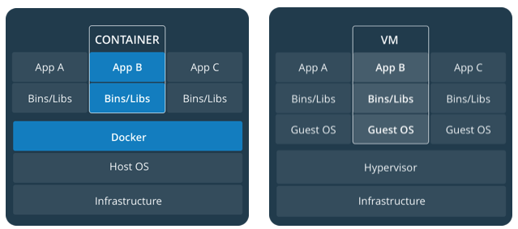
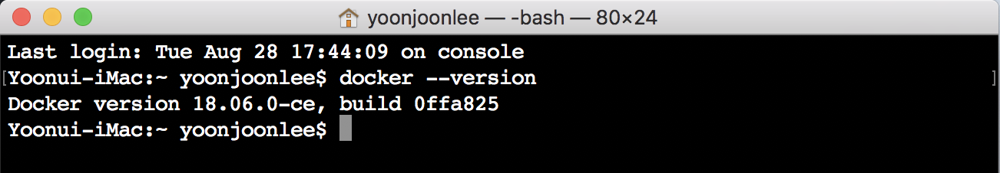
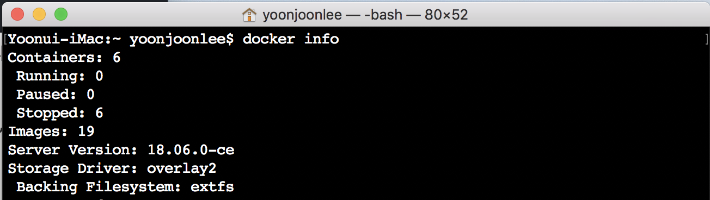
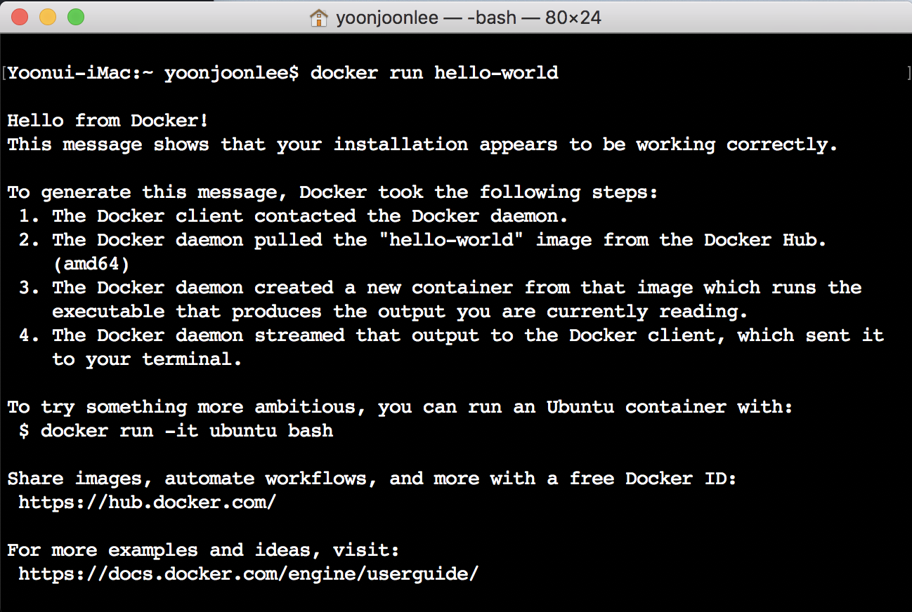
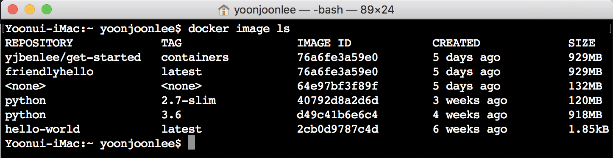
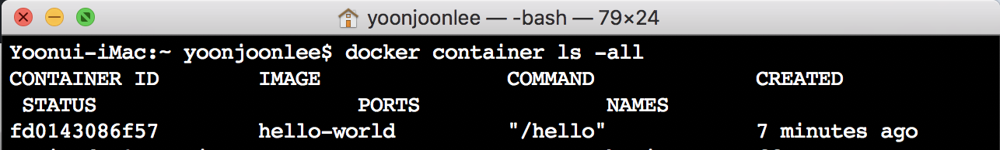

Docker 시작하기
---------------

### Orientation과 설정

Docker에 발을 들여놓으신 것을 환영합니다! <code>Docker 시작하기 Tutorial</code>은 아래에 대하여 설명합니다.

1.	Docker 소개와 설정.
2.	[이미지를 빌드하고 이를 컨테이너로 만들어 실행](containers.md).
3.	[여러 컨테이너를 실행할 수 있도록 앱 확장](services.md).
4.	[클러스터로 앱 배포](swarms.md).
5.	[백엔드 데이터베이스를 추가하여 서비스 쌓기](stacks.md).
6.	[프로덕션 환경으로 앱 전개](deploy.md).

#### Docker의 개념

Docker는 개발자 및 시스템 관리자가 컨테이너를 사용하여 응용프로그램의 **개발, 전개 및 실행** 을 위한 플랫폼입니다. Linux 컨테이너를 사용하여 응용프로그램을 전개하는 것을 *컨테이너화(conatainerization)* 라고 합니다. 새로운 것은 아니지만 응용프로그램을 쉽게 전개하기 위하여 컨테이너를 사용합니다.

컨테이너가 있어 컨테이너화가 점점 대중화되어 가고 있습니다.

-	유연성 : 아무리 복잡한 애플리케이션도 컨테이너화할 수 있습니다.
-	경량 : 컨테이너는 호스트 커널을 활용하고 공유합니다.
-	중단없는 배포 : 업데이트 및 업그레이드시에 중단없이 배포할 수 있습니다.
-	Portable : 로컬에서 빌드하고, 클라우드에 전개하고, 어디서나 실행할 수 있습니다.
-	확장성 : 컨테이너 복제본을 늘리고 자동으로 전개할 수 있습니다.
-	스태킹 가능 : 서비스를 운영 중에 쌓을 수 있습니다.


##### 이미지와 컨테이너

이미지를 실행하여 컨테이너를 시작합니다. **이미지** 는 응용프로그램 실행에 필요한 코드, 런타임, 라이브러리, 환경 변수 및 설정(configuaration) 파일 등 모든 것으로 구성된 실행 가능한 패키지입니다.

컨테이너는 이미지의 런타임 인스턴스입니다. 즉, 실행될 때 메모리에 있는 (상태 또는 사용자 프로세스 갖고 있는) 이미지입나다. Linux에서 처럼 <code>docker ps</code> 명령으로 실행 중인 컨테이너 목록을 볼 수 있습니다.

##### 컨테이너와 가상 컴퓨터

기본적으로 Linux에서 **컨테이너** 를 실행하며 호스트 시스템의 커널을 다른 컨테이너와 공유합니다. 다른 실행 파일보다 적은 메모리를 차지하며 가볍게 분리된 프로세스로 컨테이너를 실행합니다.

이와 반대로 **가상 컴퓨터 (VM)** 는 하이퍼바이저를 통해 호스트 리소스를 가상으로 접근할 수 있는 완전한 "게스트" 운영 체제를 실행합니다. 일반적으로 VM은 대부분의 응용프로그램이 필요로 하는 것보다 많은 리소스 갖춘 환경을 제공합니다.



#### Docker 환경 준비하기

공개되어 사용되고 있는 Docker Community Edition (CE) 또는 Enterprise Edition (EE) 버전을 지원하고 있는 플랫폼(운영체제)에 설치합니다.

> Kubernetes와 통합
>
> -	[Mac용 Docker를 위한 Kubernetes](https://docs.docker.com/docker-for-mac/kubernetes/)는 [17.12 Edge (mac45)](https://docs.docker.com/docker-for-mac/edge-release-notes/#docker-community-edition-18050-ce-mac67-2018-06-07) 또는 [17.12 Stable (mac46)](https://docs.docker.com/docker-for-mac/release-notes/#docker-community-edition-17120-ce-mac47-2018-01-12) 이상에서 사용할 수 있습니다.
>
> -	[Windows용 Docker를 위한 Kubernetes](https://docs.docker.com/docker-for-windows/kubernetes/)는 [18.02 Edge (win50)](https://docs.docker.com/docker-for-windows/edge-release-notes/#docker-community-edition-18020-ce-rc1-win50-2018-01-26) 이상의 상위 에지 채널에서만 사용할 수 있습니다.
>

[docker 설치하기](aboutDockerCE.md)

##### Docker 버전 테스트

1.	"docker --version"을 실행하고 지원되는 Docker 버전인지 확인하십시오.

	

2.	"docker info" (또는 --가 없는 "docker version")를 실행하면 docker 설치에 대한 자세한 내용을 볼 수 있습니다.

	

> 권한 오류 (및 <code>sudo</code> 사용)를 방지하려면 docker 그룹에 사용자를 추가하십시오. 더욱 자세한 내용은 [여기](https://docs.docker.com/install/linux/linux-postinstall/)에서 찾아 볼 수 있습니다.

##### Docker 설치 테스트

1.	간단한 Docker 이미지 [hello-world](https://hub.docker.com/_/hello-world/)를 실행하여 설치가 제대로 작동하는지 테스트하십시오.

	

2.	컴퓨터에 다운로드된 "hello-world" 이미지를 나열해 보세요.

	

3.	메시지를 표시 한 후 종료된 (이미지로부터 생성된) "hello-world" 컨테이너를 나열하십시오. 아직 실행 중이면 "--all" 옵션은 필요 없습니다.



#### 요약

```
## List Docker CLI commands
docker
docker container --help

## Display Docker version and info
docker --version
docker version
docker info

## Execute Docker image
docker run hello-world

## List Docker images
docker image ls

## List Docker containers (running, all, all in quiet mode)
docker container ls
docker container ls --all
docker container ls -aq
```

#### 결론

컨테이너화는 [CI/CD](https://www.docker.com/solutions/cicd)를 연속적으로 수행합니다. 예를 들면,

-	응용프로그램은 시스템 종속성이 없습니다.
-	업데이트를 분산 응용프로그램의 어느 부분에든 넣을 수 있습니다.
-	자원을 최적으로 촘촘히 사용할 수 있습니다.

Docker를 사용하면 애플리케이션 확장을 과도하게 VM 호스트에서 실행하지 않고 새로운 실행 파일을 퍼트림으로써 해결할 수 있습니다.

[다음 컨테이너](containers.md)
