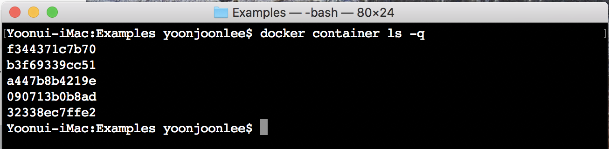
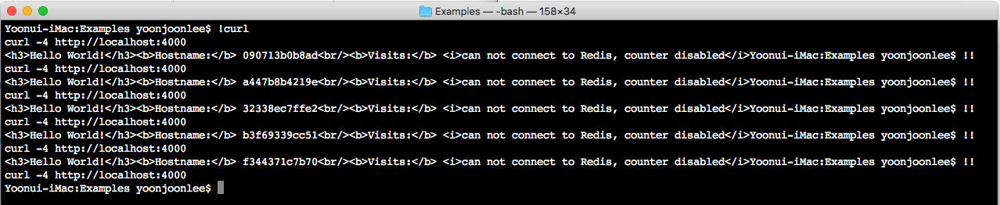
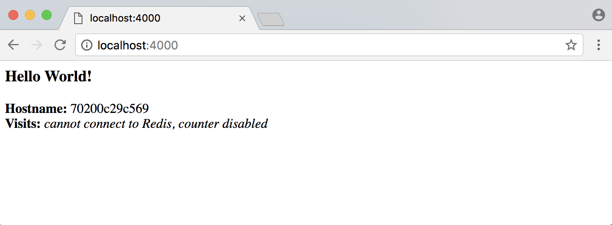

### 서비스

<a name="prerequisites"></a>

#### 준비 사항

-	[Docker 버전 1.13 이상 설치](https://docs.docker.com/engine/installation/)
-	[Docker 구성](https://docs.docker.com/compose/overview/) 하기. [Docker for Mac](https://docs.docker.com/docker-for-mac/) 및 [Docker for Windows](https://docs.docker.com/docker-for-windows/)에는 사전 설치 파일이 있어 진행할 수 있습니다. Linux 시스템에서는 [직접 설치해야 합니다](https://github.com/docker/compose/releases). *Hyper-V* 가 없는 Windows 10 이전 시스템에서는 [Docker Toolbox](https://docs.docker.com/toolbox/overview/)를 사용하여야 합니다.
-	[시작하기](orientation.md)에서 orientation을 읽으십시오.
-	[컨테이너](containers.md)에서 컨테이너를 만드는 방법에 대해 알아야 합니다.
-	[레지스트리에 등록]하여(https://docs.docker.com/get-started/part2/#share-your-image) 작성한 <code>friendlyhello</code> 이미지의 게시를 확인하십시오. 그 공유된 이미지를 예에서 사용합니다.
-	이미지를 컨테이너로 전개하여 작동하는지 여부를 확인하십시오. 이 명령을 실행하여 <code>username</code>, <code>repo</code>와 <code>tag</code>를 지정하여 : <code>docker run -p 4000 :80 username/repo:tag</code>를 실행한 다음 브라우저에서 <code>http://localhost:4000/</code>로 앱을 실행하십시오.

#### 소개

새번째로 응용프로그램을 스케일 아웃하고 부하를 조정하기 위하여 분산 응용프로그램의 계층 구조에서 한 수준 높은 서비스로 이동해야 합니다.

-	스택
-	**서비스** (여기)
-	컨테이너 ([이전](containers.md)에서 다루었슴)

#### 서비스에 대하여

분산 응용에서 응용을 이루는 부분을 "서비스"라고합니다. 비디오 공유 사이트의 경우 응용프로그램 데이터를 데이터베이스에 저장하는 서비스, 사용자가 비디오를 업로드한 후 백그라운드에서 이를 트랜스 코딩하는 서비스, 프런트 엔드를 위한 서비스 등으로 그 예를 들 수 있습니다.

서비스는 실제로 "운영 컨테이너"입니다. 서비스는 이미지 하나만을 실행하지만 이를 실행하는 방법을 지정합니다. 즉 어떤 포트를 사용해야 하는지, 컨테이너 복제본을 얼마나 실행할 수 있어야 서비스에 필요한 용량을 만족할 수 있는지 등과 같은 것입니다. 서비스를 확장하기 위하여 수행 중인 프로세스 서비스에 컴퓨팅 리소스를 얼마나 할당하여야 하는 것입니다. 이는 곧 해당 소프트웨어를 실행하는 컨테이너 인스턴스 수를 늘리는 것을 의미합니다.

다행히 Docker 플랫폼에서는 <code>docker-compose.yml</code> 파일을 작성하여 쉽게 서비스를 정의, 실행 및 확장할 수 있습니다.

#### 첫 <code>docker-compose.yml</code> 파일

YAML(YAML Ain't Markup Language) 형식의 <code>docker-compose.yml</code> 파일로 Docker 컨테이너에 대한 운영 환경에서의 작동을 설정합니다.

##### <code>docker-compose.yml</code>

아래 내용을 <code>docker-compose.yml</code> 파일로 저장합니다. [컨테이너](containers.md)에서 만든 [이미지를 레지스트리에 등록한](containers.md/#share-your-image) 다음 <code>username/repo:tag</code>를 이미지 세부 정보로 변경하여 <code>.yml</code>을 수정합니다.

```YAML
version: "3"
services:
  web:
    # replace username/repo:tag with your name and image details
    image: yjbenlee/get-started:containers
    deploy:
      replicas: 5
      resources:
        limits:
          cpus: "0.1"
          memory: 50M
      restart_policy:
        condition: on-failure
    ports:
      - "4000:80"
    networks:
      - webnet
networks:
  webnet:
```

<code>docker-compose.yml</code> 파일은 Docker가 수행할 아래와 같은 작업을 지정합니다.

-	[컨테이너 절에서 업로드한 이미지](containers.md)를 레지스트리에서 가져옵니다.
-	각 인스턴스에 (모든 코어에 걸쳐)최대 10% CPU와 50MB RAM으로 사용을 제한하며 <code>web</code>이라는 서비스 이미지의 5개 인스턴스를 실행합니다.
-	컨테이너가 하나라도 수행을 실패하면 즉시 다시 시작합니다.
-	호스트 포트 4000을 "web" 포트 80에 매핑합니다.
-	<code>webnet</code>이라는 부하 분산 네트워크를 통해 포트 80을 공유하도록 <code>web</code>의 컨테이너에 지시합니다. (내부적으로 컨테이너 자체는 임시 포트를 <code>web</code> 포트 80으로 게시합니다.)
-	<code>webnet</code> 네트워크를 로드 밸런싱 오버레이 네트워크의 기본 설정으로 정의합니다.

<a name="run-your-new-load-balanced-app"> </a>

#### 부하 분산이 되는 새로운 앱 실행

<code>docker stack deploy</code> 명령을 사용하려면 먼저 다음을 실행하십시오.

```
docker swarm init
```

> Note : [스웜](swarm.md)에서 자세히 다루겠지만 <code>docker swarm init</code>를 실행하지 않으면 "이 노드는 스웜 관리자가 아닙니다."라는 오류가 발생합니다.

이제 실행해 봅시다. 앱 이름을 <code>getstartedlab</code>으로 설정합니다.

```
docker stack deploy -c docker-compose.yml getstartedlab
```

단일 서비스 스택으로 배포된 이미지의 5 컨테이너 인스턴스를 하나의 호스트에서 실행합니다.

애플리케이션은 각 서비스마다 서비스 ID를 갖습니다.

```
docker service ls
```

앱 이름이 앞에 붙은 웹 서비스 출력을 찾아 보십시오. 예제에서와 같이 이름을 지정하면 이름은 <code>getstartedlab_web</code>입니다. 서비스 ID, 복제본 번호, 이미지 이름과 사용 포트도 함께 보여줍니다.

서비스에서 실행되는 단일 컨테이너를 **타스크(task)** 라고합니다. 타스크에는 <code>docker-compose.yml</code>에 설정된 복제본 수까지 증가하는 고유한 ID를 부여합니다. 서비스의 타스크을 보여줍니다.

```
docker service ps getstartedlab_web
```

서비스로 필터링되지는 않지만 시스템의 모든 컨테이너를 나열하면 타스크도 나타납니다.

```
docker container ls -q
```



한 줄에 <code>curl -4 http://localhost:4000</code> 명령을 연속으로 여러 번 실행하거나 브라우저에서 해당 URL로 이동하여 몇 번 새로 고침하십시오.





둘 중 어느 쪽이든, 컨테이너 ID가 변경되어 부하를 분산하는 것을 보여줍니다. 각 요청마다 5 타스크중 한 타스크가 라운드 로빈 방식으로 응답하도록 선택됩니다. 컨테이너 ID는 이전 명령 <code>docker container ls -q</code> 출력과 일치합니다.

> <u>Window 10에서 실행</u>
>
> Windows 10 PowerShell은 <code>curl</code>명령을 지언합니다. 그렇지 않다면 [Git BASH](https://git-for-windows.github.io/)와 같은 Linux 터미널 에뮬레이터를 사용하거나 이와 매우 흡사한 [wget for Window](http://gnuwin32.sourceforge.net/packages/wget.htm)을 다운로드하여 사용할 수 있습니다.
>
> <u>느린 응답 시간?</u>
>
> 네트워킹 구성 환경에 따라 컨테이너가 HTTP 요청에 응답하는 시간은 최대 30초 정도 걸릴 수 있습니다. 이는 Docker 또는 Swarm 성능 때문이 아니고 튜토리얼 뒷부분에서 다룰 Redis 종속성 때문입니다. 같은 이유로 당분간 방문자 카운터는 작동하지 않습니다. 이는 아직 데이터를 유지하는 서비스를 추가하지 않았기 때문입니다.

#### 앱 확장

<code>docker-compose.yml</code>의 복제 수를 변경하고 저장한 다음 <code>docker stack deploy</code>을 다시 실행하여 앱을 확장할 수 있습니다.

```
docker stack deploy -c docker-compose.yml getstartedlab
```

Docker는 그 자리에 직접 업데이트를 수행하므로 먼저 스택에서 없애거나 컨테이너를 정지시킬 필요가 없습니다.

이제 <code>docker container ls -q</code>를 다시 실행하면 배포된 인스턴스가 재구성된 것을 볼 수 있습니다. 복제본을 확장하였다면 더 많은 타스크가 생겨서 더 많은 컨테이너를 시작합니다.

##### 앱과 스웜 내리기

-	<code>docker stack rm</code>으로 앱을 다운시킵니다.

```
docker stack rm getstartedlab
```

-	스웜을 내립니다.

```
docker swarm leave --force
```

Docker를 사용하여 앱을 실행하고 확장할 수 있습니다. 이제 운영 환경에서 컨테이너를 실행하는 방법을 배우는 걸음을 띠었습니다. 다음으로, Docker 시스템 클러스터에서 bonafide 스웜으로 앱을 실행하는 법을 배울 것입니다.

> **Note**: Docker를 사용하여 응용프로그램을 정의하는 데 이와 같이 Compose 파일을 작성하여 [Docker Cloud](https://docs.docker.com/docker-cloud/)를 사용하는 클라우드 제공자에 업로드하거나 [Docker Enterprise Edition](https://www.docker.com/enterprise-edition)에서 선택한 하드웨어 또는 클라우드 제공자에 업로드할 수 있습니다.
