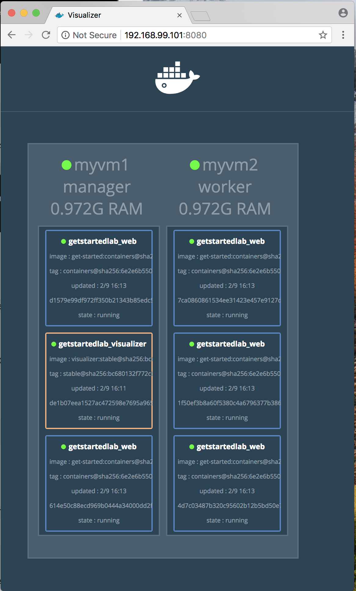
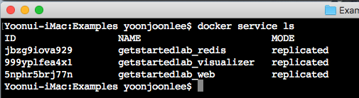
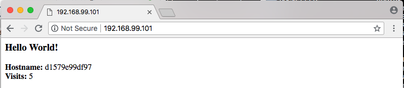
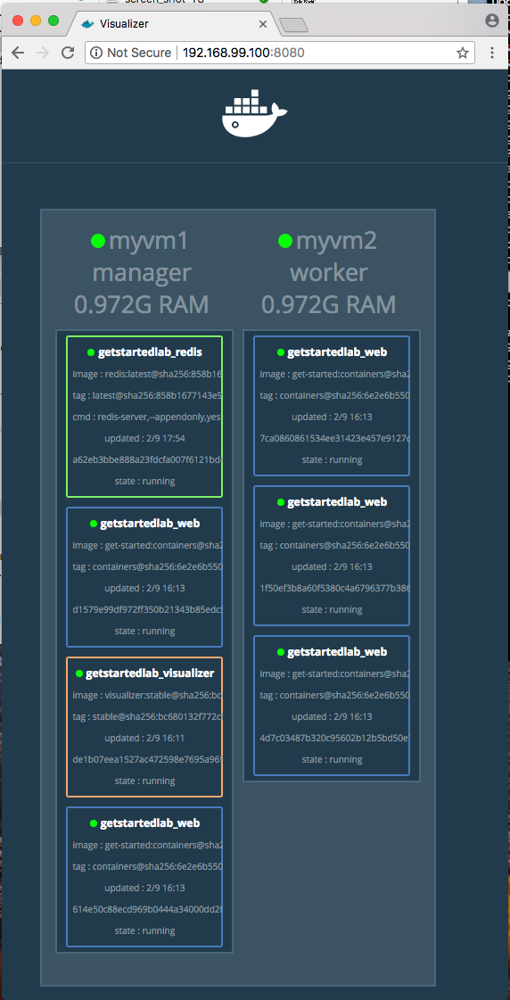

### 스택

#### <a name="prerequisites"></a>준비 사항

-	[Docker 버전 1.13 이상 설치](https://docs.docker.com/engine/installation/)
-	[서비스 준비사항](services.md#prereqisites)에서 설명한 대로 [Docker 구성](https://docs.docker.com/compose/overview/) 하십시요.
-	[스웜 준비사항](swarms.md#prerequisites)에서 설명한 [Docker Machine](https://docs.docker.com/machine/overview/)을 만듭니다.
-	[시작하기](orientation.md)에서 orientation을 읽으십시오.
-	[컨테이너](containers.md)에서 컨테이너를 만드는 방법에 대해 알아야 합니다.
-	[레지스트리에 푸시하여](https://docs.docker.com/get-started/part2/#share-your-image) 작성한 <code>friendlyhello</code> 이미지의 게시를 확인하십시오. 그 공유된 이미지를 예에서 사용합니다.
-	이미지를 컨테이너로 전개하여 작동하는지 여부를 확인하십시오. 이 명령을 실행하여 <code>username</code>, <code>repo</code>와 <code>tag</code>를 지정하여 : <code>docker run -p 80:80 username/repo:tag</code> 명령을 실행한 다음 브라우저에서 <code>http://localhost</code>을 실행하여 보십시오.
-	[서비스](services.md)에서 편리하게 <code>docker-compose.yml</code>를 복사하십시요.
-	[스웜](swarms.md)에서 설정 한 기계가 작동하고 준비 상태인지 확인하십시오. <code>docker-machine ls</code>를 실행하여 이를 확인하십시오. 시스템이 중지되면 <code>docker-machine start myvm1</code>를 실행하여 매니저를 시작한 다음 <code>docker-machine start myvm2</code>를 실행하여 워커를 시작하십시오.

#### 개요

[스웜](swarms.md)에서는 Docker를 실행하는 시스템 클러스터인 스웜을 설정하고 컨테이너를 여러 컴퓨터에서 동시에 실행하도록 응용프로그램을 전개하는 방법을 배웠습니다.

여기 스택에서는 분산 응용프로그램 계층 구조의 최상위인 스택 레벨을 설명합니다. 스택은 종속성을 공유하는 상호 연관된 서비스의 그룹이며 함께 조정 및 확장될 수 있습니다. 단일 스택은 전체 응용 프로그램의 기능을 정의하고 조정할 수 있습니다 (매우 복잡한 응용프로그램은 여러 스택을 사용할 수도 있습니다).

다행인 것은, Compose 파일을 작성하고 <code>docker stack deploy</code>를 사용하여 [서비스](services.md)부터 기술적으로 스택을 사용하여 작업을 했다는 것입니다. 그러나 이는 단일 호스트에서 실행되는 단일 서비스 스택이었습니다. 이는 일반적으로 프로덕션 환경에서 발생하지 않습니다. 여기서는 배운 것을 받아들이고 여러 서비스를 서로 관련 시키며 여러 컴퓨터에서 실행할 수 있습니다.

여러분은 훌륭한 일을 하고 있으며, 이것은 연습입니다!

#### 새로운 서비스를 추가하고 다시 전개하기

<code>docker-compose.yml</code> 파일에 서비스를 추가하는 것은 쉽습니다. 먼저, 우리의 스웜이 컨테이너를 어떻게 스케쥴하는 지를 보여주는 무료 시각화 서비스를 추가합니다.

1.	편집기에서 <code>docker-compose.yml</code>을 열고 내용을 다음과 같이 변경하십시오. 특히 <code>username/repo:tag</code>를 이미지 세부 정보로 바꾸십시오.

	```YAML
	version: "3"
	services:
	    web:
	        # replace username/repo:tag with your name and image details
	        image: yjbenlee/get-started:containers
	        deploy:
	            replicas: 5
	            restart_policy:
	                condition: on-failure
	            resources:
	                limits:
	                  cpus: "0.1"
	                  memory: 50M
	    ports:
	        - "80:80"
	    networks:
	        - webnet
	visualizer:
	    image: dockersamples/visualizer:stable
	    ports:
	        - "8080:8080"
	    volumes:
	        - "/var/run/docker.sock:/var/run/docker.sock"
	    deploy:
	        placement:
	            constraints: [node.role == manager]
	    networks:
	        - webnet
	networks:
	    webnet:
	```

	새로운 것은 <code>visualizer</code>라 부르는 <code>web</code>에 대한 피어 서비스 입니다. visualize에게 Docker 용 호스트 소켓 파일에 대한 액세스 권한을 부여하는 <code>volume</code> 키와 <code>placement</code> 키를 사용하여이 서비스가 워커가 아닌 스웜 관리자만 실행하도록 합니다. [Docker가 만든 오픈 소스 프로젝트](https://github.com/ManoMarks/docker-swarm-visualizer)를 기반으로 작성된이 컨테이너는 다이어그램의 덩치에서 실행되는 Docker 서비스를 표시하기 때문입니다.

	placement 제약과 volume에 대해 더 알아봅니다.

2.	쉘이 <code>myvm1</code>과 통신하도록 구성되었는지 확인하십시오 (전체 예제는 [여기](swarms.md/#configure-a-docker-machine-shell-to-the-swarm-manager)에 있습니다).

	-	<code>docker-machine ls</code>를 실행하여 가상 컴퓨터를 나열하고 그 옆에 별표가 표시된 <code>myvm1</code>에 연결되어 있는지 확인하십시오.

	-	필요하다면, <code>docker-machine env myvm1</code>을 다시 실행하고 쉘을 구성하도록 주어진 명령을 실행하십시오.

		Mac 또는 Linux에서의 명령

		```
		eval $(docker-machine env myvm1)
		```

		Window에서의 명령

		```
		& "C:\Program Files\Docker\Docker\Resources\bin\docker-machine.exe" env myvm1 | Invoke-Expression
		```

3.	관리자에서 <code>docker stack deploy</code> 명령을 다시 실행하면 업데이트가 필요한 서비스를 업데이트합니다.

	```
	$ docker stack deploy --compose-file docker-compose.yml getstartedlab
	Updating service getstartedlab_web (id: angi1bf5e4to03qu9f93trnxm)
	Creating service getstartedlab_visualizer (id: l9mnwkeq2jiononb5ihz9u7a4)
	```

4.	시각화 프로그램을 보십시오.

	Compose 파일에서 visualizer가 포트 8080에서 실행되도록 한 것을 보았습니다. <code>docker-machine ls</code>를 실행하여 노드 중 하나의 IP 주소 포트 8080으로 가면 다음과 같이 실행중인 visualizer를 볼 수 있습니다.

	

	visualizer의 단일 복사본은 예상대로 관리자가 실행 중이며 웹 인스턴스 5 개는 웜 전체에 분산되어 있습니다. <code>docker stack ps \<stack\></code>을 실행하여이 시각화를 확인할 수 있습니다.

	```
	docker stack ps getstartedlab
	```

	visualizer는 스택에 포함 된 모든 앱에서 실행할 수있는 standalone 서비스입니다. 다른 서비스에 의존하지 않습니다. 이제 종속성이 있는 서비스를 만들어 봅시다. 방문자 카운터를 제공하는 Redis 서비스.

#### 데이터 유지(Persist)

앱 데이터를 저장하기위한 Redis 데이터베이스를 추가하기 위해 동일한 워크 플로를 한 번 더 따라가 보겠습니다.

1.	<code>Redis</code> 서비스를 추가한 새로운 <code>docker-compose.yml</code> 파일을 저장하고 <code>username/repo:tag</code>를 이미지 세부 정보로 수정하십시오.

	```YAML
	version: "3"
	services:
	    web:
	        # replace username/repo:tag with your name and image details
	        image: username/repo:tag
	        deploy:
	            replicas: 5
	            restart_policy:
	                condition: on-failure
	            resources:
	                limits:
	                    cpus: "0.1"
	                    memory: 50M
	        ports:
	            - "80:80"
	        networks:
	            - webnet
	    visualizer:
	        image: dockersamples/visualizer:stable
	        ports:
	            - "8080:8080"
	        volumes:
	            - "/var/run/docker.sock:/var/run/docker.sock"
	        deploy:
	            placement:
	                constraints: [node.role == manager]
	        networks:
	            - webnet
	    redis:
	        image: redis
	        ports:
	            - "6379:6379"
	        volumes:
	            - "/home/docker/data:/data"
	        deploy:
	            placement:
	                constraints: [node.role == manager]
	        command: redis-server --appendonly yes
	        networks:
	            - webnet
	networks:
	    webnet:
	```

	Redis는 Docker 라이브러리에 공식 이미지가 있으며, 단지 redis라는 짧은 이미지 이름이 부여되어 있으며 <code>username/repo</code> 표기법은 없습니다. Redis 포트 6379는 컨테이너에서 호스트로 노출되도록 Redis에 의해 사전 구성되어 있습니다. 위의 Compose 파일에는 호스트의 컨테이너는 전세계로 노출되므로 실제 Redis Desktop Manager 노드의 IP 주소를 입력하여 Redis 인스턴스를 관리합니다.

	중요한 점은 스택을 전개할 떄 데이터를 유지하도록 몇 가지 사항을 redis에 지정하여야 합니다.

	-	<code>redis</code>는 항상 관리자에서 실행되므로 항상 동일한 파일 시스템을 사용합니다.
	-	<code>redis</code>는 호스트의 파일 시스템에 있는 임의의 디렉토리를 Redis가 데이터를 저장하는 컨테이너 내부의 <code>/data</code>로 접근합니다.

	이렇게 함으로써 Redis 데이터를 위하여 호스트의 물리적 파일 시스템에 "원본"을 만듭니다. 이 기능이 없으면 Redis는 컨테이너의 파일 시스템 내부에 <code>/data</code>에 데이터를 저장합니다. 이 경우 해당 컨테이너를 다시 전개하면 데이터는 지워집니다.

	이를 위하여 두 가지 구성 요소가 있습니다.

	-	Redis 서비스에 지정한 placement 제약 조건으로 항상 동일한 호스트를 사용합니다.
	-	컨테이너가 (Redis 컨테이너 내부의)<code>/data</code>로 (호스트의) <code>./data</code>를 접근할 수 있도록 생성한 볼륨. 컨테이너를 수행하는 동안에도 지정된 호스트의 <code>./data</code>에 저장된 파일은 계속 유지되므로 연속성을 유지할 수 있습니다.

	Redis를 사용하는 새로운 스택을 배포 할 준비가되었습니다.

2.	관리자에 ./data 디렉토리를 만듭니다.

	```
	docker-machine ssh myvm1 "mkdir ./data"
	```

3.	쉘이 <code>myvm1</code>과 통신하도록 구성되었는지 확인하십시오 (전체 예제는 [여기](swarms.md/#configure-a-docker-machine-shell-to-the-swarm-manager)에 있습니다).

	-	<code>docker-machine ls</code>를 실행하여 가상 컴퓨터를 나열하고 그 옆에 별표가 표시된 <code>myvm1</code>에 연결되어 있는지 확인하십시오.

	-	필요하다면, <code>docker-machine env myvm1</code>을 다시 실행하고 쉘을 구성하도록 주어진 명령을 실행하십시오.

		Mac 또는 Linux에서의 명령

		```
		eval $(docker-machine env myvm1)
		```

		Window에서의 명령

		```
		& "C:\Program Files\Docker\Docker\Resources\bin\docker-machine.exe" env myvm1 | Invoke-Expression
		```

4.	<code>docker stack deploy</code>를 다시 실행하십시요.

	```
	docker stack deploy --compose-file docker-compose.yml getstartedlab
	```

5.	<code>docker service ls</code>를 실행하여 세가지 서비스가 예상대로 실행되는지 확인합니다.

	

6.	노드 중 하나(<code>http://192.168.99.101</code>)에서 웹 페이지를 확인하고 현재 방문자 카운터 결과를 보고 Redis에 정보를 저장하십시오.

	

	또한 노드의 IP 주소에서 포트 8080에<cide>web</code>과 <code>visualizer</code>와 함께 실행되는 <code>redis</code> 서비스를 확인하십시오.

	

	다음 [앱 전개](deployApp.md)
