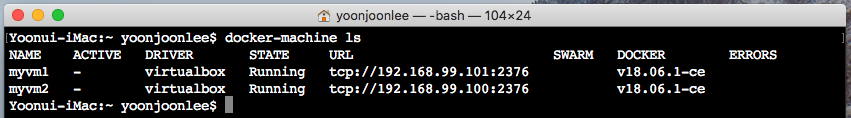
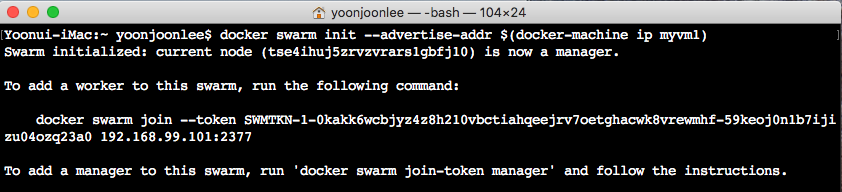
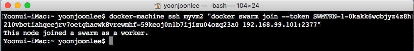
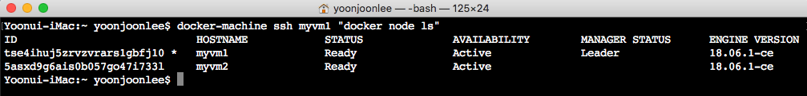
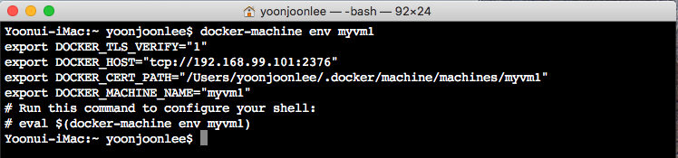
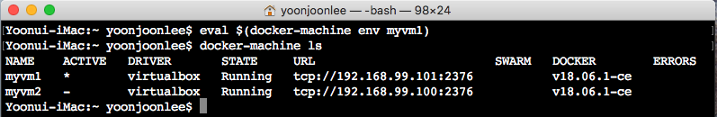
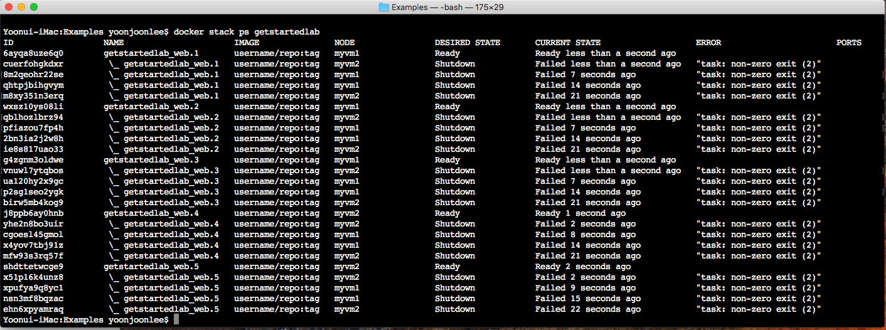
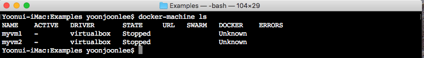
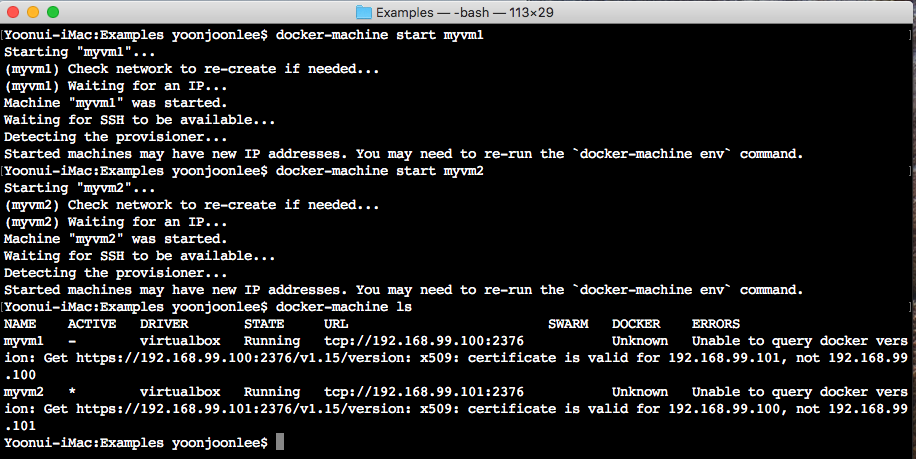

### 스웜

<a name="prerequisites"></a>

#### 준비 사항

-	[Docker 버전 1.13 이상 설치](https://docs.docker.com/engine/installation/).
-	[서비스 준비사항](services.md/#prerequisites)에서 처럼 [Docker Compose](https://docs.docker.com/compose/overview/) 구성.
-	[Docker Machine](https://docs.docker.com/machine/overview/) 만들기. 이는 [Docker for Mac](https://docs.docker.com/docker-for-mac/) 및 [Docker for Windows](https://docs.docker.com/docker-for-windows/) 설치 파일로 설치하거나 Linux 시스템에서는 [직접 설치합니다](https://github.com/docker/compose/releases). *Hyper-V* 가 없는 Windows 10 이전 시스템에서는 [Docker Toolbox](https://docs.docker.com/toolbox/overview/)를 사용하여야 합니다.
-	[시작하기](orientation.md)에서 orientation을 읽으십시오.
-	[컨테이너](containers.md)에서 컨테이너를 만드는 방법에 대해 알아야 합니다.
-	[레지스트리에 등록하여](https://docs.docker.com/get-started/part2/#share-your-image) 작성한 <code>friendlyhello</code> 이미지의 게시를 확인합니다. 공유된 이미지를 예에서 사용합니다.
-	이미지를 컨테이너로 전개하여 작동 여부를 확인하십시오. 이 명령을 실행하여 <code>username</code>, <code>repo</code>와 <code>tag</code>를 지정하여 <code>docker run -p 80:80 username/repo:tag</code>을 실행한 다음 브라우저에 <code>http://localhost/</code>을 입력하여 앱을 실행합니다.
-	[서비스](services.md)에서 작성한 <code>docker-compose.yml</code>를 복사합니다.

#### 개요

[서비스](services.md)에서는 [컨테이터](containers.md)에서 작성한 응용프로그램을 서비스로 전환하여 운영 환경에서 실행하는 방법을 보여주었으며, 프로세스에서 5 서비스까지 확장했습니다.

여기 스웜에서는 이 응용프로그램을 여러 컴퓨터에서 실행할 수 있도록 클러스터에 전개합니다. 여러 컴퓨터를 **스웜** 이라고 불리는 "Dockerized" 클러스터로 결합하여 다중 컨테이너, 다중 컴퓨터 응용프로그램 수행을 가능케 합니다.

#### 스웜 클러스터

클러스터에 있으며 Docker를 실행하는 컴퓨터 그룹을 스웜이라 합니다. 지금까지는 사용자가 Docker 명령을 클러스터의 컴퓨터에 계속 실행할 수 있지만, 이제는 **스웜 관리자** 가 클러스터에서 이를 실행합니다. 클러스터를 구성하는 물리 컴퓨터이거나 가상 컴퓨터가 스웜에 참여하면 이들 모두 **노드** 라고 부릅니다.

스웜 관리자는 활용도가 가장 낮은 컴퓨터에 컨테이너 수행을 할당하는 "emptiest node" 등과 같은 컨테이너를 실행하기 위한 몇 가지 전략을 사용할 수 있습니다. 또는 각 컴퓨터가 지정된 컨테이너의 인스턴스를 정확히 하나씩 수행하는 "global" 전략도 있습니다. 설명하였던 것처럼 Compose 파일에서 전략 사용을 스웜 관리자에게 지정합니다.

스웜 관리자는 명령을 실행하거나 스웜에 속한 다른 컴퓨터에게 **워커(worker)** 권한을 부여할 수 있는 스웜 내의 유일한 노드압니다. 워커는 오직 앱 수행만을 위해 존재하며, 다른 컴퓨터에게 수행 가능 여부를 알려 줄 수 없습니다.

지금까지 로컬 시스템에서 단일 호스트 모드로 Docker를 사용 해왔습니다. 그러나 스웜을 사용하면 **스웜 모드** 로 전환이 가능합니다. 순간적으로 스웜 모드를 활성화하면 현재 시스템은 스웜 매니저가 됩니다. 그때부터 현재 컴퓨터에서 수행하는 명령뿐만 아니라 관리중인 스웜에서 수행하는 명령들까지 Docker는 실행합니다.

#### 스웜 설정

물리 또는 가상 컴퓨터인 노드들로 스웜을 구성합니다. 기본 개념은 간단합니다. 스웜 모드를 활성화하기 위하여 <code>docker swarm init</code>를 실행하여 현재 컴퓨터를 스웜 매니저로 만듭니다. 다음 다른 컴퓨터를 스웜에 워커로 참여하도록 그 컴퓨터에서 <code>docker swarm join</code> 명령을 실행합니다. 아래에 다양한 상황에서 이를 어떻게 진행하는지 확인하십시오. 우리는 VM을 사용하여 두 대의 컴퓨터로 구성된 클러스터를 신속하게 만들고 이를 스웜으로 구성합니다.

##### 클로스터 생성

<u>Mac, Linux 및 Window 7과 8 로컬 컴퓨터에서 VM 만들기</u>

가상 머신 (VM)을 생성 할 수있는 하이퍼 바이저가 필요하므로 머신의 OS 용 [Oracle VirtualBox를 설치](https://www.virtualbox.org/wiki/Downloads) 합니다.

> **Note**:
>
> Windows 10과 같이 Hyper-V가 설치된 Windows 시스템을 사용하는 경우 VirtualBox를 설치할 필요가 없고 대신 Hyper-V를 사용합니다. [Docker Toolbox](https://docs.docker.com/toolbox/overview/)를 사용하고 있다면 VirtualBox가 이미 포함되어 있으므로 시작할 수 있습니다.

이제 VirtualBox 드라이버를 활용하여 <code>docker-machine</code> 명령으로 VM 2개를 만듭니다.

```
docker-machine create --driver virtualbox myvm1
docker-machine create --driver virtualbox myvm2
```

<u>로컬 VMs (Window 10/Hyper-V)</u> to be completed

<u>**VM을 열거하고 그들의 IP주소를 가져오기**</u>

이제 <code>myvm1</code>과 <code>myvm2</code>라는 두 개의 VM을 생성하였습니다.

아래 명령을 사용하여 가상 컴퓨터를 나열하고 IP 주소를 가져옵니다.

```
docker-machine ls
```

위 명령의 출력은 다음과 같습니다.



<u>**스웜 초기화와 노드 추가**</u>

첫 번째 컴퓨터는 관리자 역할을 수행하며, 관리 명령을 실행하고 워커를 인증하여 스웜에 가입시키며, 두 번째는 워커입니다.

<code>docker-machine ssh</code>를 사용하여 VM에 명령을 수행할 수 있습니다. <code>docker swarm init</code>으로 <code>myvm1</code>를 스웜 관리자가 되도록 아래와 지시합니다.



> <u>포트 2377과 2376</u>
>
> 항상 <code>docker swarm init</code>와 <code>docker swarm join</code> 명령은 포트를 전혀 사용하지 않고 기본값으로 설정되었다면 스웜 관리 포트인 포트 2377에서 수행합니다.
>
> <code>docker-machine ls</code> 출력에서 컴퓨터 IP 주소는 Docker 데몬 포트 인 포트 2376을 포함하고 있습니다. 이 포트를 사용하지 마십시오. [오류가 발생할 수 있습니다](https://forums.docker.com/t/docker-swarm-join-with-virtualbox-connection-error-13-bad-certificate/31392/2).
>
> <u>SSH 사용에 문제 있습니까? <code>--native-ssh</code> 플래그를 사용해 보십시오.</u>
>
> 스웜 관리자에게 명령할 때 문제가 있다면 [사용자 시스템의 SSH를 사용할 수있는 옵션](https://docs.docker.com/machine/reference/ssh/#different-types-of-ssh)이 Docker에 있습니다. <code>ssh</code>를 호출할 때 <code>--native-ssh</code> 플래그를 사용하십시요.
>
> ```
> docker-machine --native-ssh ssh myvm1 ...
> ```

아래에서와 같이 <code>docker swarm init</code>의 츨력에는 추가하려는 노드에서 실행할 수 있도록 미리 구성된 <code>docker swarm join</code> 명령이 있습니다. 이 명령을 복사하여 <code>docker-machine ssh</code>를 통해 <code>myvm2</code>로 보내면 <code>myvm2</code>를 새로운 스웜에 워커로 참여시킬 수 있습니다.



축하합니다, 첫 번째 스웜를 만들었습니다!

관리자에서 <code>docker node ls</code>를 실행하면 이 스웜의 노드를 볼 수 있습니다.



> <u>스웜에서 나가기</u>
>
> 모든 노드에서 <code>docker swarm leave</code>를 실행하여 처음부터 다시 시작할 수 있습니다.

#### 스웜 클러스터에서 앱 전개(deploy)하기

어려운 부분을 막 끝냈습니다. 이제 새 스웜에 앱을 전개하기 위하여 [서비스](services.md)에서 사용한 프로세스를 반복합니다. <code>myvm1</code>과 같은 관리자에서만 오직 Docker 명령을 실행한다는 점 주의하십시오. 워커들은 단지 앱 수행을 위한 것입니다.

##### <code>docker-machine</code> 쉘로 스웜 관리자 구성

지금까지 VM에게 명령하기 위하여 <code>docker-machine ssh</code> 명령에 Docker 명령을 랩핑하여 사용하였습니다. 또 다른 옵션은 <code>docker-machine env \<machine\></code>을 실행하여 현재 쉘을 구성하고, 이를 이용하여 VM의 Docker 데몬과 통신하는 명령을 실행하는 것입니다. 이 방법은 로컬 <code>docker-compose.yml</code> 파일을 사용하여 어디서나 복사하지 않고도 "원격"으로 응용프로그램을 전개할 수 있으므로 다음 단계에서 더 잘 작동합니다.

<code>docker-machine env myvm1</code>을 입력하고, 출력의 마지막 줄 명령을 복사하여 실행하여 쉘이 웜 관리자인 myvm1과 통신하도록 구성하십시오.

쉘을 구성하는 명령은 Mac, Linux 또는 Windows에 따라 다릅니다. 아래 예제를 참조하십시요.

<u>MAC 또는 LINUX에서 DOCKER MACHINE 쉘 환경</u>

<code>docker-machine env myvm1</code>을 실행하여 <code>myvm1</code>과 통신하도록 쉘을 구성하는 명령을 얻으십시오.



주어진 명령을 실행하여 쉘이 <code>myvm1</code>과 통신하도록 구성하십시오.

```
eval $(docker-machine env myvm1)
```

<code>docker-machine ls</code>를 실행하여 별표가 표시된대로 <code>myvm1</code>이 현재 활성 시스템인지 확인하십시오.



##### 스웜 관리자에서 앱 전개(deploy)하기

이제 myvm1을 사용했으므로 스웜 관리자 권한을 사용하여 [서비스](services.md)에서 사용했던 <code>docker stack deploy</code> 명령과 <code>docker-compose.yml</code>의 로컬 복사본을 사용하여 응용프로그램을 전개할 수 있습니다. 완료하는 데 몇 초 걸릴 수 있습니다. 스웜 관리자에 <code>docker service ps \<service_name\></code> 명령으로 모든 서비스의 재전개를 확인합니다.

<code>docker-machine</code> 쉘 설정을 사용하여 <code>myvm1</code>에 연결되어 있고 로컬 호스트의 파일에 계속 접근할 수 있습니다. [서비스](services.md)에서 만든 <code>docker-compose.yml</code> 파일을 포함하여 이전 모든 파일들이 같은 디렉토리에 있는지 확인하십시오.

이전과 마찬가지로 <code>myvm1</code>에 앱을 전개하려면 다음 명령을 실행하십시오.

```
docker stack deploy --compose-file docker-compose.yml getstartedlab
```

여기까지 입니다. 앱을 스웜 클러스터에 전개합니다.

> **Note**:
>
> 이미지가 Docker Hub 대신 개인 레지스트리에 저장되어있는 경우 <code>docker login <your-registry></code>에 <code>--with-registry-auth</code>를 플래그를 추가하여 로그인해야 합니다.
>
> ```
> docker login registry.example.com
>
> docker stack deploy --with-registry-auth --compose-file docker-compose.yml getstartedlab
> ```
>
> 그러면 암호화 된 WAL 로그를 사용하여 로컬 클라이언트로부터 서비스를 전개한 스웜 노드로 로그인 토큰이 전달됩니다. 이 정보로 노드는 레지스트리에 로그인하여 이미지를 가져올 수 있습니다.

이제 [서비스에서 사용한 동일한 도커 명령](services.md/#run-your-new-load-balanced-app)을 사용할 수 있습니다. 이때 서비스(및 연관된 컨테이너)가 <code>myvm1</code>과 <code>myvm2</code>에 분산되어 있음을 알 수 있습니다.



> <code>docker-machine env</code>와 <code>docker-machine ssh</code>으로 VM에 연결하기
>
> -	<code>myvm2</code>와 같이 다른 시스템과 통신하도록 쉘을 설정하려면 쉘에서 <code>docker-machine env</code>를 다시 실행한 다음 주어진 명령을 실행하여 <code>myvm2</code>를 가리 키십시오. 이것은 항상 현재 쉘에만 적용됩니다. 구성하지 않은 쉘로 변경하거나 새 쉘을 열려면 명령을 다시 실행해야 합니다. <code>docker-machine ls</code>를 사용하여 컴퓨터를 나열하고, 그들이 어떤 상태인지 파악하고, IP 주소를 얻고, 연결된 경우 어떤 것이 있는지 찾아볼 수 있습니다. 자세한 내용은 [Docker Machine 시작하기 주제](https://docs.docker.com/machine/get-started/#create-a-machine)를 참조하십시오.
> -	또는 Docker 명령을 <code>docker-machine ssh \<machine\> "\<command\>"</code>형식으로 래핑 할 수도 있습니다.이 명령은 VM에 직접 기록하지만 로컬 호스트의 파일을 즉시 액세스 할 수는 없습니다.
> -	Mac과 Linux에서는 <code>docker-machine scp \<file\> \<machine\>:~</code>을 사용하여 여러 컴퓨터에서 파일을 복사 할 수 있지만 이를 위하여 Windows 사용자는 <code>Git Bash</code>와 같은 Linux 터미널 에뮬레이터가 필요합니다.
>
> <code>docker-machine ssh</code>와 <code>docker-machine env</code> 모두 <code>docker-machine CLI</code>를 통해 모든 플랫폼에서 사용할 수 있습니다.

#### 클러스터로 접근

<code>myvm1</code> 또는 <code>myvm2</code>의 IP 주소로 앱에 접근할 수 있습니다.

사용자가 만든 네트워크는 네트워크간에 공유되며 부하 분산을 수행합니다. <code>docker-machine ls</code>를 실행하여 VM의 IP 주소를 얻고 브라우저에서 이들 중 한 주소에서 새로 고침(또는 <code>curl</code>명령으로)하십시요.

임의로 사이클링이 가능한 컨테이너 ID 5 개간의 부하 분산을 보여줍니다.

두 IP 주소가 작동하는 이유는 스웜의 노드가 **입장(ingress) 라우팅 메쉬** 에 참여한다는 것입니다. 이렇게하면 실제로 컨테이너를 실행중인 노드가 무엇이든 관계없이 스웜의 특정 포트에 전개된 서비스가 항상 해당 포트를 소유하도록 할 수 있습니다. 아래 그림은 3 노드 스웜에서 포트 <code>8080</code>에 게시된 <code>my-web</code> 서비스를 위한 라우팅 메쉬 다이어그램입니다.


> 연결에 문제가 있습니까?
>
> 스웜 모드를 활성화하기 전에 스웜에서 수신 네트워크를 사용하려면 스웜 노드간에 다음 포트를 열어야합니다.
>
> -	컨테이너 네트워크 탐색을 위한 TCP/UDP 포트 7946.
> -	컨테이너 입장 네트워크를 위한 TCP/UDP 포트 4789.

#### 앱의 확장과 반복

이제 컨테이너와 서비스에서 배운 모든 것을 할 수 있습니다.

<code>docker-compose.yml</code> 파일을 수정하여 앱을 확장할 수 있습니다.

코드를 수정하여 앱의 작동을 변경한 다음 새 이미지를 다시 작성하고 등록합니다. (이렇게 하려면 이전에 [앱을 제작](containers.md/#build-the-app)하고 [이미지를 게시하는 데](containers.md/#publish-the-image) 사용한 단계를 따르십시오).

두 경우 모두 간단하게 <code>docker stack deploy</code>를 다시 실행하여 변경 사항을 전개하십시오.

<code>myvm2</code>에서 사용한 동일한 <code>docker swarm join</code> 명령을 사용하여 실제 또는 가상 컴퓨터를 이 스웜에 가입시킬 수 있으며 클러스터에 용량이 추가됩니다. 나중에 <code>docker stack deploy</code>를 실행하면 앱이 새로운 리소스를 이용할 수 있습니다.

#### 정리 및 재부팅

##### 스택과 스웜

<code>docker stack rm</code>을 사용하여 스택을 제거할 수 있습니다.

```
docker stack rm getstartedlab
```

> 스웜을 유지할까? 제거할까?
>
> 워커에서 <code>docker-machine ssh myvm2 "docker swarm leave"</code>와 매니저에서 <code>"docker-machine ssh mymv1 "docker swarm leave --force"</code>로 스웜을 제거 할 수 있습니다. 유지하고 싶다면 [스택](stacks.md)을 참고하십시요.

##### docker-machine 쉘 변수 설정 해제

주어진 명령으로 현재 쉘의 <code>docker-machine</code> 환경 변수 설정을 해제 할 수 있습니다.

**Mac** 과 **Linux** 에서

```
eval $(docker-machine env -u)
```

**Window** 에서

```
 & "C:\Program Files\Docker\Docker\Resources\bin\docker-machine.exe" env -u | Invoke-Expression
```

이렇게하면 <code>docker-machine</code>에서 만든 가상 컴퓨터와 셸의 연결이 끊어지며 예를 들어 Mac 용 Docker 또는 Windows 용 Docker에서의 기본 <code>docker</code> 명령을 사용하여 동일한 셸에서 계속 작업 할 수 있습니다.여 자세한 내용은 [환경 변수 설정 해제](https://docs.docker.com/machine/get-started/#unset-environment-variables-in-the-current-shell)를 참조하십시오.

#### Docker 가상 컴퓨터 재시작

로컬 호스트를 종료하면 Docker 시스템도 중지됩니다. <code>docker-machine ls</code>를 실행하여 컴퓨터의 상태를 볼 수 있습니다.



중지시킨 시스템을 다음과 같이 다시 시작할 수 있습니다.

```
docker-machine start <machine-name>
```


